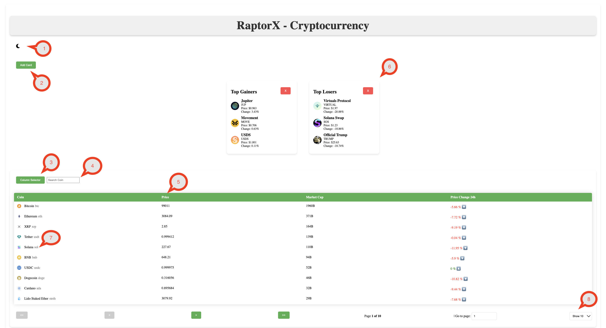

# RaptorX

## Overview

RaptorX is a React-based web application that provides real-time cryptocurrency market data. It features a dashboard with various components such as cards and tables to display top gainers, top losers, and detailed coin information. The application uses context for state management and Axios for data fetching.




# Website UI Features

This document outlines the key features of the website UI, as illustrated in the provided screenshot with marked points from 1 to 8.

## Features

### 1. Dark Mode/Light Mode Toggle
- The website allows users to switch between dark mode and light mode for a personalized viewing experience.

### 2. Add and Remove Cards
- **Add Card Button**: Adds a new card to the UI.
- **Remove Cards**: Cards can be removed by clicking the cross button on them.
- **Draggable and Droppable**: Cards can be rearranged using drag-and-drop functionality.

### 3. Column Selector
- Users can choose specific columns to display in the table, providing flexibility in how data is presented.

### 4. Search Bar
- A search bar is available to quickly find specific coins in the table based on their names or other attributes.

### 5. Sorting
- Users can sort the table data in ascending or descending order by clicking on the sort button.

### 6. Draggable and Droppable Cards
- Cards can be rearranged using drag-and-drop functionality by simply clicking and holding the card.

### 7. Detailed View for Table Rows
- Clicking on a particular table row navigates to a detailed view of the selected coin, providing more information.

### 8. Rows Per Page Selector
- Users can select the number of rows to display in the table, choosing from options like 10, 20, 30, or 100 rows per page.

---


### Prerequisites

- **Node.js** (v14 or higher)
- **npm** (v6 or higher)

### Installation

1. Clone the repository:
   ```sh
   git clone https://github.com/yourusername/raptorx.git
   cd raptorx
   ```

2. Install dependencies:
   ```sh
   npm install
   ```

3. Start the development server:
   ```sh
   npm run dev
   ```

---

## Component Structure

### Main Components

- **App.jsx**: The root component that sets up the theme and data providers and defines the main routes.
- **Dashboard.jsx**: The main dashboard page that includes the card and table components.
- **CoinDetails.jsx**: A detailed view for individual coins, displaying charts and statistics.

### Components

- **Card**: Displays top gainers and losers with drag-and-drop functionality.
  - Files: `Card.jsx`, `Card.css`
- **Chart**: Displays historical data for a selected coin.
  - Files: `Chart.jsx`, `Chart.css`
- **Table**: Displays a table of cryptocurrency data with sorting, filtering, and pagination.
  - Files: `Table.jsx`, `Table.css`

### Context

- **DataContext**: Manages the global state for fetched cryptocurrency data.
  - File: `DataContext.jsx`
- **ThemeContext**: Manages the global theme state (light/dark mode).
  - File: `ThemeContext.jsx`

### Utilities

- **Utils.js**: Contains utility functions for formatting numbers.

### Services

- **apiService.js**: Contains functions for fetching data from the CoinGecko API.

---

## State Management

State management is handled using React's Context API. The **DataContext** provides the fetched cryptocurrency data to all components, while the **ThemeContext** manages the application's theme.

---

## Data Handling

Data is fetched from the CoinGecko API using Axios. The `fetchData` function in `apiService.js` handles the API requests. The data is then stored in the **DataContext** and made available to all components.

---

## Layout Logic

The layout is managed using CSS and responsive design principles. The application supports both light and dark themes, which are toggled using the **ThemeContext**.

---

## Additional Features

- **Drag-and-Drop**: The Card component supports drag-and-drop functionality using `react-beautiful-dnd`.
- **Responsive Design**: The application is fully responsive and adapts to different screen sizes.
- **Charting**: The Chart component uses `react-chartjs-2` to display historical data in both line and bar chart formats.

---

## Limitations

- **API Rate Limits**: The application relies on the CoinGecko API, which has rate limits that may affect data fetching.

---

## Notable Decisions

- **Context API**: Simplifies the global state handling and makes the application more scalable.
- **Axios for Data Fetching**: Chosen for its simplicity and ease of use in handling HTTP requests.

---

## Configuration

The application configuration is stored in `config.json`, which includes the API URL and polling interval.

```json
{
  "apiUrl": "https://api.coingecko.com/api/v3/coins/markets?vs_currency=usd",
  "apiPollingInterval": 5000
}
```

---

## Dependencies

- **react**: A JavaScript library for building user interfaces.
- **react-dom**: Serves as the entry point to the DOM and server renderers for React.
- **react-router-dom**: DOM bindings for React Router.
- **axios**: Promise-based HTTP client for the browser and node.js.
- **react-beautiful-dnd**: Beautiful and accessible drag-and-drop for lists with React.
- **react-chartjs-2**: React wrapper for Chart.js.
- **@fortawesome/react-fontawesome**: Font Awesome 5 React component.
- **@fortawesome/free-solid-svg-icons**: Font Awesome Free Solid icons.

---

## Conclusion

RaptorX is a robust and scalable application for monitoring cryptocurrency markets. With its modular component structure, efficient state management, and responsive design, it provides a seamless user experience for both desktop and mobile users.


